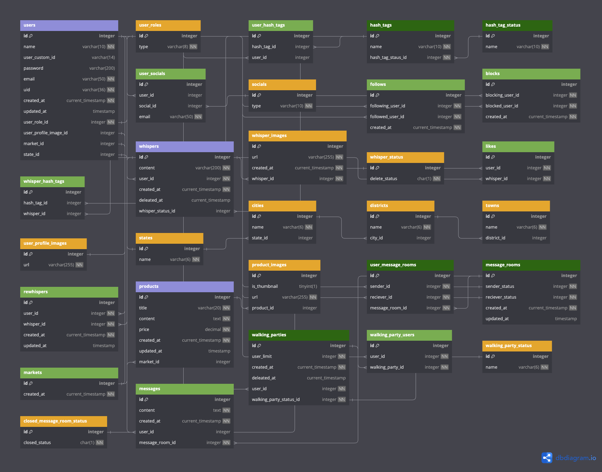

# 반짝

    반려동물과 함께하는 사람들을 위한 일상, 정보 공유 커뮤니티 서비스

# 프로젝트 정보

## 제작 기간

    2023.12 ~ 진행중

## 구성 인원

| 이름   | 역할    | 기능   |
| ------ | ------- | ------ |
| 고은채 | Backend | 위스퍼 |
| 이현진 | Backend | 유저   |

# 적용 기술 및 구현 기능

## 적용 기술

- FE: Next.js, ReactQuery, shadcn/ui(+tailwind css), SCSS module, TypeScript
- BE: Nest.js, TypeORM, TypeScript, MySQL, AWS, S3, CI/CD(예정)

## 구현 기능

### User

- 다른 반려인을 팔로잉하여 나만의 타임라인을 만들 수 있습니다.
- 사용자는 로컬 또는 소셜 계정으로 가입하여 서비스를 이용할 수 있습니다.

### Whisper

- 반려동물과 함께하는 일상을 자유롭게 기록하고 반려인들과 공유할 수 있습니다.
- 위스퍼 작성 시 컨텐츠와 관련된 키워드를 생성하고 추가할 수 있습니다.

### Community

- 커뮤니티를 통해 유용한 팁과 자신만의 노하우를 공유할 수 있습니다.

### Market

- 다른 반려인과 반려동물 용품을 거래할 수 있습니다.
- 더 이상 필요하지 않은 반려동물 용품을 나눔 또는 거래 할 수 있습니다.

### Notification

- 다른 반려인과의 상호작용을 실시간으로 알림을 받을 수 있습니다.

### HashTag

- 회원가입 시 동일한 해시태그를 선택한 다른 반려인들을 추천받을 수 있습니다.
- 특정 해시태그를 통해 해당 해시태그와 관련된 위스퍼를 조회할 수 있습니다.

### Setting

- 관심 있는 다른 반려인의 주제나 활동에 대한 업데이트를 우선적으로 보거나, 원하지 않는 콘텐츠를 필터링할 수 있습니다.

### Message

- 서로 팔로우중인 반려인과 1:1 메시지를 주고 받을 수 있습니다.

### Walking Party

- 산책 이벤트를 생성해 함께 산책할 근교의 다른 반려인을 모집할 수 있습니다.
- 같은 동네의 반려인들과 함께 산책하는 오프라인 모임을 만들 수 있습니다.

# ERD

# API 문서

[PostMan DOCS](https://documenter.getpostman.com/view/28839133/2s9YsT4nSW)

# 기획서

<a href="https://fern-shape-a88.notion.site/ab6df8de8df74e508a3ac724ad513d9c">기획서 바로가기</a>
